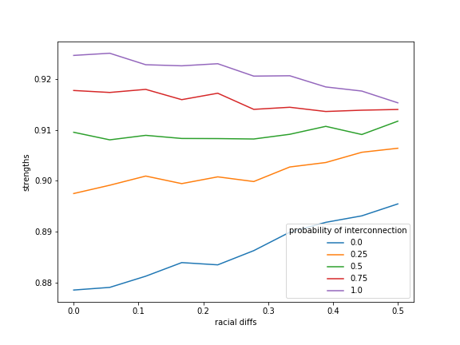

# Effects of Race, Gender, and Sexual Orientation on Marriages with Online Dating

## Serena Chen and Apurva Raman

## Abstract

Ortega and Hergovich, in their paper “The Strength of Absent Ties” [1] model marriages in social networks as influenced by online dating. They find that there are far more interracial couples and that couples have higher compatibility as a result of online dating (modeled by the addition of more interracial connections), and that the marriages are stronger. Ortega and Hergovich’s only model heterosexual marriages, so we modify the model to see if their result holds when not all of the marriages are heterosexual.

We find that interracial relationships are more common and marriages are stronger as a result of increasing the probability of interracial connections for an all-bisexual society as well. We also find that the effect (on compatibility) of increasing the probability of interracial connections is weaker in an all-bisexual society. When bisexual agents of the same sex tend to have a higher compatibility with each other, **[result here? When the compatibility with the same gender of the bisexual agents increases even slightly, there is rapid increase in preference of same gender partners, until the number of same gender couples reaches the maximum.]**.

We also investigate what happens if people of the same race tend to have higher compatibility with each other and find **[result here]**.

## Methodology and Modeling Decisions
Ortega and Hergovich model marriages in social networks to find how online dating affects what they define as welfare metrics for the society: racial integration and strength of marriages. They find that online dating, which they model by increasing the probability of interracial connections, results in more interracial marriages and that marriages overall are stronger.

To do this, they construct an Erdos-Renyi random graph where each node is an agent that has a sex, a race, and two variables that represent their personality.

**Sex**: Agents have a binary sex. The number of agents of either sex are approximately equal for each race.

**Race**: Agents belong to one of n races. Each race has the same number of agents that belong to them. Agents can only belong to one race.

**Probability of interracial and intraracial connections**: Each agent has a likelihood of being connected in the graph to a member of a different race with a set probability. Each agent also has a likelihood of being connected to a member of a different race with a different probability. These values are both inputs to the simulation.

**Personality variables**: The personality (which are used in calculating compatibility) of each agent are a randomly chosen variable between 0 and 1. The closer one agent’s values are to another, the more compatible they are with each other, which Ortega and Hergovich use to indicate how strong the marriage is.  

**Marriage**: There are two modes of marriage that we model. For the first, at each timestep in the simulation, agents will point to the agent they are directly connected to that has the closest preferences. They can only point at people of the other sex. If that agent also points at them, they are married. These we refer to as “direct marriages”. The other type, “long marriage”, has the same process but allows agents to point to agents they are connected to through a mutual friend (distance 2 away).

Ortega and Hergovich note that people often interact with many more people of the same race offline because societies tend to be segregated. However, online dating allows strangers to meet, which corresponds to an increased likelihood of interracial connections. Thus, they model the presence of online dating by increasing the likelihood of interracial connections. The assumption that people do not have many interracial connections doesn’t hold true in the world because [people of a minority race will tend to have connections to people of a majority race while people of a majority race may not have many connections to minorities](https://www.washingtonpost.com/news/wonk/wp/2014/08/25/three-quarters-of-whites-dont-have-any-non-white-friends/?utm_term=.d9e9b0a7ae47). However, for simplicity they choose to make each race equally common, so that there are no minorities or majorities.

They also note that even though it seems intuitive that increasing the probability of interracial connections would increase the number of interracial marriages, the addition of one interracial marriage could destroy the possibility of two others.  It could also decrease the total number of marriages.

## Replication

Ortega and Hergovich have the original MATLAB code freely available on Ortega’s website, so we reimplement the experiment in python and check that the behavior of our experiment matches the behavior of Ortega’s MATLAB code. We have two ways of checking that the experiment is replicated correctly. The first is to check that similar parameters give similar results in both the MATLAB implementation and our Python implementation (Figure 1). The results are not be identical since there is an element of randomness in the models, but they are close.

The original paper measures 2 statistics about the model:

**Diversity**, or the ratio of interracial marriages. If this measure is 1, the percentage of interracial marriages is the same as the percentage of interracial pairs if everyone were connected to everyone else.

**Compatibility**, or how similar the married couple’s personalities are. This is calculated by sqrt((difference in social beliefs)^2 + (difference in political beliefs)^2). This is also referred to as “strength.”

**Figure 1:** *race* is the same thing as *diversity*, *avgdist* is the same as *compatibility*. *number* is the percentage of individuals that are married. The top shows the result of the MATLAB code. The bottom shows the result of the Python code. They were both run with 3 races, 100 agents per race, 70% probability of a connection within a race, and 40% probability of a connection between races.

The second method of checking that the behavior is the same is to verify the graphs in the paper are consistent with graphs we generate. Ortega and Hergovich have some graphs where they plot diversity and compatibility with respect to a changing probability of having an interracial connection Their graphs and our graphs are shown below in figures 2 and 3.

**Figure 2:** The average compatibility (0-1, where 1 is perfectly compatible/everyone married someone of identical personality) as the probability of interracial connections increases. On the top is Ortega and Hergovich’s graph, on the bottom is our graph. The label dir here refers to direct marriages.

Our graph has roughly the same shape as Ortega and Hergovich’s, but there is much more noise. Both our simulation and Ortega and Hergovich’s simulation was run repeatedly and averaged, but Ortega and Hergovich do not report how many times the simulation was run. The difference is likely due to the discrepancy in the number of runs. From Figure 2, we can tell that as interracial connections increase, compatibility and strength of marriages increases as well, but at a decreasing rate. This gives us confidence that our replication of the Ortega and Hergovich model was successful.

**Figure 3:** The "diversity", or percentage of interracial marriages to the percentage of possible interracial links (where 1 means that number of interracial marriages matches the number of interracial marriages if we had just randomly picked pairs to marry) as the probability of interracial connections increase. Left is Ortega and Hergovich’s graph, the right is our graph.

Similarly to Figure 2, our graph is similar in shape to Ortega and Hergovich’s, with some noise. We get the same result as Ortega and Hergovich, which is that as interracial connections increase, so do interracial links.

Thus we can conclude that our replication of Ortega and Hergovich's experiment was successful in producing the same results, and that as interracial connections increase (as they do in the presence of online dating), the number of interracial marriages and the compatibility of those marriages is greater.

## Adding bisexuality

Rosenfeld and Thomas’s 2012 paper, “Searching for a mate: the rise of the internet as a social intermediary,” states that same-sex couples are more likely than heterosexual couples to find their partner through online dating[2]. Ortega and Hergovich address this in their paper, but state that introducing same-sex couples would cause instability in the model.

Our first experiment is to add in bisexuality. The only difference here is that agents can point to agents of the same sex. Again, we look at the compatibility and percentage of interracial marriages for increasing interracial connection probability. We run the simulation with the same parameters.

**Figure 4:** The average compatibility as the probability of interracial connections increases in an all-bisexual society.

We can see from this graph that the strengths in the all-bisexual society are all slightly higher (starting at about 9.2 rather than 8.5 and ending at 9.5 rather than 9.0), but the general shape is preserved. Since there are more potential marriage candidates for agents in the all-bisexual society, there is an increased likelihood that they will find a better match. However, this effect is only slight because the compatibility between agents is already so high.

The range of probabilities is less for the all bisexual society because the starting compatibility is already so high. This means that the effect of changing the probability of interracial connection (increasing online dating) is less than for the all heterosexual society.

**Figure 5:** The percentage of interracial marriages to the percentage of possible interracial links as the probability of interracial connections increase for an all-bisexual society.

The shape of the curve is slightly closer to linear than for the heterosexual society, but the range and shape is about the same. In the all-bisexual society, there is no major difference in the percentage of interracial links compared to the results from our replication of Ortega and Hergovich's experiment.

## Gender differences

Our second experiment is to add difference between genders in terms of compatibility to see if this changes the results. This experiment explores what would happen in the all-bisexual society if the things people would like their partner to share with them are more likely to be shared with people of the same gender.

If we hypothesize that societal gender roles support fostering certain hobbies, personality traits, or values, we could model the effect of that by drawing from a normal distribution of personality values for men and women and have the means for each gender be slightly offset. As the difference between the means increases, there will be less similarity between people of different genders, but there will be an overlap.

With this extension, this model takes what has previously been considered sex by Ortega and Hergovich and considers it gender. However, it is also still simplified as binary.
Additionally, there is nothing in the model to represent pressure to be in a heterosexual marriage.

We run the simulation with various differences in personality between genders to see the effect on compatibility and the genders of married agents. As there is no change to the interracial connections, there will be no change in number of interracial marriages.

**Figure 6:** The average compatibility as the difference in personality between genders increases in an all-bisexual society.

As the difference in personality between genders increases, the average compatibility decreases. This is expected, since the overall spread of personality also increases, which results in decreased compatibility. There are fewer agents with high compatibility available to any given agent for high gender personality difference values. This helps us check that the modification to the model works as expected. We then

**Figure 7:** The number of married same-gender (mm and ww) couples and the number of different-gender couples (mw) as the amount of difference between the means (for personality traits and compatibility) increases.

As the difference increases beyond 0.5, there are more same-gender couples than different-gender couples. With sufficient difference, all agents are most compatible with agents of the same gender.

The rapid drop in number of same-gender couples couples as the difference in personality between genders increases is indicative that even slight difference between genders results in strong preference for same-gender marriages.

## Racial Differences

Our third experiment is to add differences in personality due to race rather than gender. Since we know from our replication of Ortega and Hergovich's experiment that increased interracial connections increased strength and percentage of interracial couples, we test to see whether that holds when there are compatibility differences between races.

Similarly to the hypothesis about gender differences, we could expect that social stratification and cultural differences that are related to race result in people being less likely to have "perfect compatibility". It could also represent the effect of pressure in society to marry someone of the same race.

Just as with the gender differences, we model racial differences by pulling from normal distributions where the means for each race are linearly spaced. We see what the relationship is between the strength of marriages and size of mean compatibility difference between races.

**Figure 8:** **caption here**

# interpretation here

We then see what the relationship is between amount of racial difference and the percentage of interracial marriages. We expect that as the amount of difference (incompatibility) increases, the number of interracial marriages decreases.

**Figure 9:** **caption here**

# interpretation here

## Future work

The model Ortega and Hergovich made and our extended model both make several simplifying assumptions.

It would be useful to investigate whether increasing the probability of interracial relationships would be more or less impactful if the network was a Barabasi-Albert graph instead of a Erdos-Renyi graph. Although the Erdos-Renyi graph has the small world property, it would be useful to see if having agents with very high degree affect the results.

Additionally, starting with a Barabasi-Albert graph with clustering around race would allow for doing random reconnection like the Erdos-Renyi process to simulate addition of connections via online dating.

Integration of two equally-sized populations may also be easier than integration of a minority group. Modifying the model to allow having races of different populations would allow this to be tested. Allowing agents to belong to multiple racial groups or have some continuous representation of race (and generations of racial intermixing) could also be an interesting extension to this model.

Similarly, having a spectrum of different types of people an agent can be attracted to rather than binary sex may capture a more nuanced and less oversimplified view of sexuality. It is also another variable where preferential choice of agents comes into play. It would also allow for agents not just looking for similarity in their partner, but for a specific range of traits that could be similar to or different from their own.

Research on what affects people's choices of partner and whether those things are affected by race an gender (and to what degree) would be useful. It would help us identify whether the hypotheses in the racial differences and gender differences experiments are valid.

## Annotated Bibliography

Ortega, J., & Hergovich, P. (2017). The Strength of Absent Ties: Social Integration via Online Dating. ArXiv e-prints. Retrieved October 24, 2017, from https://arxiv.org/pdf/1709.10478.pdf.

This paper models marriages in social networks and the impact of online dating, specifically in racial diversity. Before online dating, someone usually dated people they had mutual friends with, or people in their community, which were usually racially homogenous. However, online dating allowed people to meet others outside their community, which is less racially homogenous. They generate these communities using random graphs (Erdos-Renyi), and model each node's preferences using a number between 0 and 1 for its social preferences and political preferences. The authors then analyze the models and determine if the introduction of online dating has improved the welfare of society. The finding of the model is consistent with previous findings, such as the increase in interracial couples in America and that marriages from online dating are stronger than marriages from traditional means of dating.

Rosenfeld, M. and Thomas, R. (2012). “Searching for a mate: the rise of the internet as a social intermediary,” *American Sociological Review*, 77, 523-547.

Rosenfeld and Thomas use results from the How Couples Meet and Stay Together survey to determine behavior (and changes in behavior over time) of couples with the rise of online dating. In particular, they outline differences in how heterosexual and same-sex couples use online dating. Ortega and Hergovich use this paper for providing the context for their paper, and we could use it to extend their model to same-sex couples.

Erdos, P. and Renyi, A. (1959) “On random graphs 1.” *Publicationes Matheimaticae (Debrecen)*, 6, 290-297.

Ortega and Hergovich construct random graphs using the method outlined in this paper by Erdos and Renyi, and we will be using the same method to replicate their experiment.
